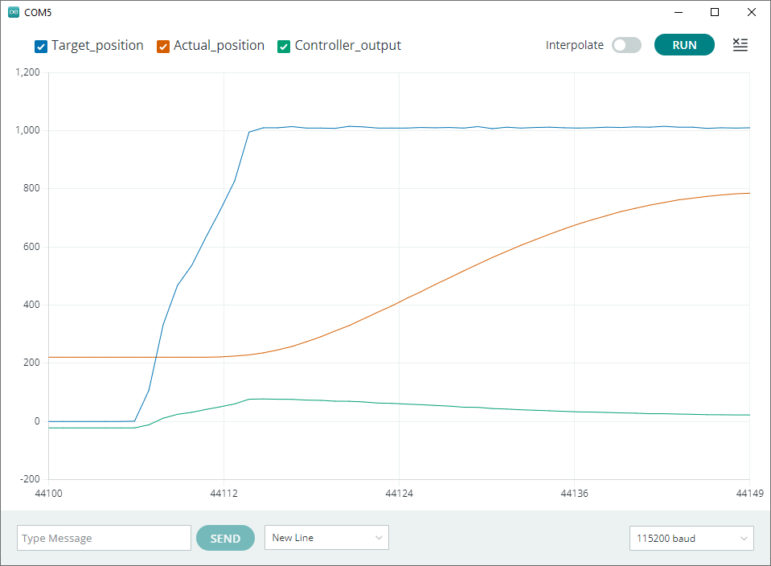
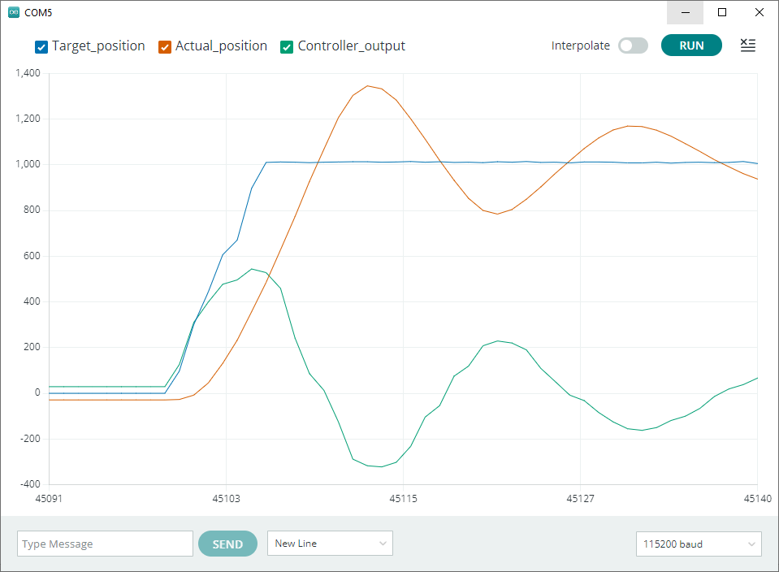
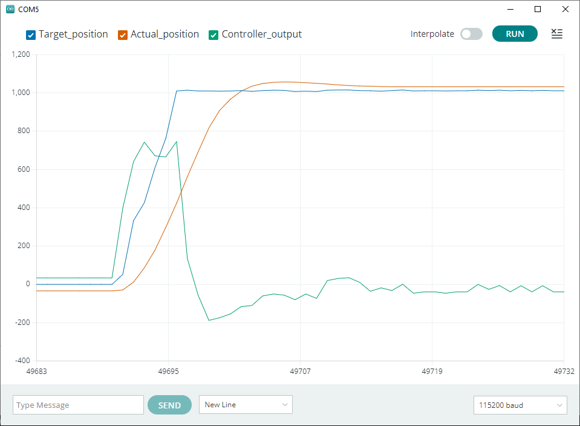

# Getting Started with Robot Programming

Example code for Chapter 5.

## DC Servo motor plots

These are the same plots as shown in the book. 
Since they require color information but the book is printed in grayscale, they are reproduced here.

### Low gain P control

Figure 5.6:

### P control

Figure 5.7:

### PD control

Figure 5.8:

